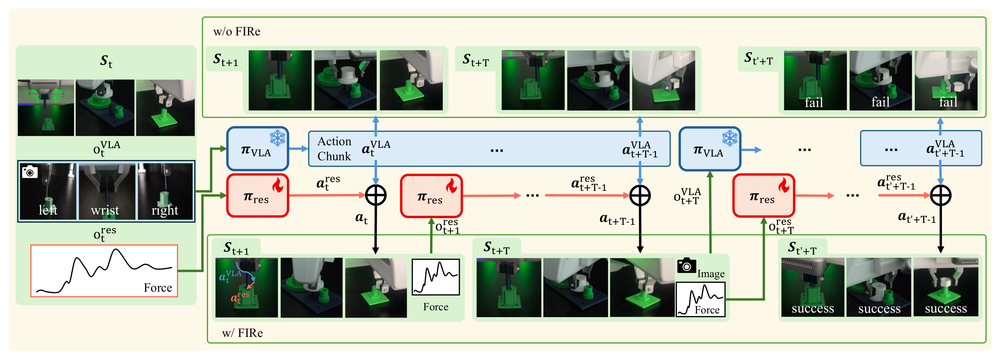

# FIRe — Force-Informed Residual Policy

FIRe improves a **Vision-Language-Action (VLA)** model at **contact-rich robotic manipulation**
(peg insertion, gear meshing, nut threading) by adding a **force-aware residual RL policy** on top of
it. The VLA plans from vision and language; the residual policy watches contact force and adds fine
corrections at every control step. It is trained in simulation and runs zero-shot on a real Franka FR3.



*Without the residual (top) the VLA-only policy fails; with FIRe's force-aware residual (bottom) the
contact-rich assembly succeeds.*

## Repository layout

- **[`fire_lab/`](fire_lab/README.md)** — simulation & training (Isaac Lab). Trains the residual RL
  policy on a frozen VLA and integrates the VLA backends (GR00T, pi05, OpenVLA).
- **[`fire_deploy/`](fire_deploy/README.md)** — real-robot deployment (ROS 2). Runs the trained
  models on a physical Franka FR3.

## Getting started

```bash
git clone --recurse-submodules https://github.com/chohh7391/FIRe.git
cd FIRe
```

The two components have **separate, incompatible environments** — set up each in its own conda env,
following its README:

- Simulation / training → **[`fire_lab/README.md`](fire_lab/README.md)** (Isaac Sim 5.1, Python 3.11)
- Real-robot deployment → **[`fire_deploy/README.md`](fire_deploy/README.md)** (Python 3.10, ROS 2)

Typical flow: train the residual policy in `fire_lab` → run it on the real robot from `fire_deploy`.

---

Based on the paper *"FIRe: Force-Informed Residual Policy for Contact-Rich Manipulation with
Vision-Language-Action Models"* (submitted to IEEE RA-L, 2026).
